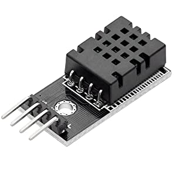
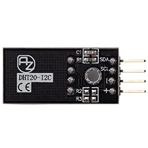
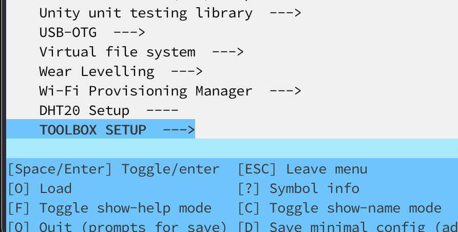
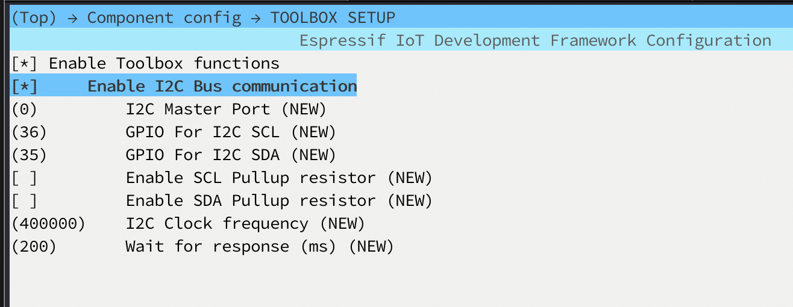

# DHT20 I2C Humidity and Temperature Sensor  (for ESP-IDF)

This the I2C version of the popular DHT11 sensor (I assume, actually I don't know).  
  




## Setup
This time I created an extra component called TOOLBOX which contains my most often used functions especially for I2C.  
I menuconfig the DHT20 sensor has a dependency on TOOLBOX so first enable and configure this component before you can enable the DHT20 Sensor.  
  
Run: "idf.py menuconfig"  


And configure:  
  
  
And no you can enable the Sensor:  
  


See esp-idf-dht20.c in the main folder for some basic usage.  
  
Initialize the I2C bus and sensor by first calling:  
 dht20_begin();

Declare a dht20_data_t struct to store your measurements. 
 *dht20_data_t* my_values;  
  
And call: 
```c
dht20_read_data(&my_values);
```  
Call this function in a loop or in a FreeRTOS task (see example).  
Values can be accessed via:  
 ```c
 my_values->humidity;  
 my_values->temperature;
 ```  

### sources
Manufacturer website: http://aosong.com/en/products-67.html  
From this website a sample program can be downloaded.  
Sensor's datasheet, see docs folder.  
Rob Tillaart Arduino Library: https://github.com/RobTillaart/DHT20/  
DFRobot Arduino Library: https://github.com/DFRobot/DFRobot_DHT20/  

ESP-IDF v5.1.1
Vscode + Espressif IDF v1.6.4 Extension.  